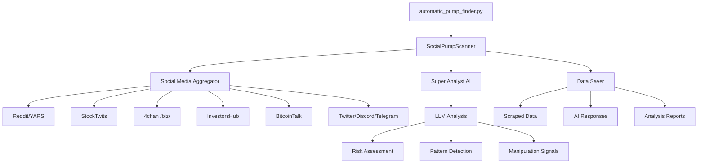

# The Intelligent LLM Investor

<div align="center">


**AI-Powered Pump & Dump Detection System**

*Automatically detect potential pump & dump schemes across social media platforms using advanced LLM analysis*

</div>

---

## Overview

The Intelligent LLM Investor is a sophisticated financial analysis tool that automatically scans multiple social media platforms to detect potential pump & dump schemes in real-time. Using state-of-the-art language models and comprehensive data aggregation, it provides investors with early warning signals about suspicious market manipulation activities.

### Key Features

- **Automatic Detection**: No need to specify tickers - the system automatically finds trending stocks
- **Multi-Platform Coverage**: Scans Reddit, StockTwits, 4chan, InvestorsHub, BitcoinTalk, and more
- **AI-Powered Analysis**: Uses advanced LLMs to analyze sentiment, patterns, and manipulation signals
- **Real-Time Monitoring**: Continuously scans for new pump & dump activities
- **Comprehensive Reporting**: Detailed analysis with risk scores, confidence levels, and evidence
- **Data Preservation**: Saves all scraped data and AI analyses for future reference

## Architecture



## Installation

### Prerequisites

- Python 3.8 or higher
- OpenRouter API key for LLM access

### Setup

1. Clone the repository:
```bash
git clone https://github.com/yourusername/the-intelligent-llm-investor.git
cd the-intelligent-llm-investor
```

2. Install dependencies:
```bash
pip install -r requirements.txt
```

3. Set your OpenRouter API key:
```bash
export OPENROUTER_API_KEY="your-api-key-here"
```

## Usage

### Basic Usage

Find top pump & dump candidates automatically:
```bash
python automatic_pump_finder.py
```

### Advanced Options

```bash
# Find top 5 candidates and analyze top 3 with AI
python automatic_pump_finder.py --top 5 --analyze 3

# Set minimum mention threshold
python automatic_pump_finder.py --min-mentions 20

# Full options
python automatic_pump_finder.py --help
```

### Output Example

```
🔍 Scanning social media for pump & dump activity...
├─ Minimum mentions: 10
├─ Finding top: 5 candidates
└─ AI analysis for: top 3

✅ Scan completed in 45.2 seconds!

📊 FOUND 127 TOTAL TICKERS
   Active (>10 mentions): 12

🏆 TOP 5 TRENDING TICKERS:
------------------------------------------------------------
  # 1 $PUMP   - 145 mentions
  # 2 $SCAM   -  89 mentions  
  # 3 $MOON   -  67 mentions
  # 4 $BTC    -  45 mentions
  # 5 $DOGE   -  32 mentions

📊 AI ANALYSIS RESULTS:
============================================================

🔴 #1 $PUMP
   Pump Probability: 95%
   Risk Level: EXTREME
   Confidence: 92%
   Phase: Active pumping
   
   Key Findings:
   - Coordinated posting across multiple platforms
   - Unusual volume spike (2400% increase)
   - Multiple new accounts promoting
   
   Red Flags:
   - "Get in now before it's too late" messaging
   - Promise of 10x returns
   - No fundamental basis for price movement
```

## Data Storage

All data is saved in the `pump_data/` directory:

```
pump_data/
├── scraped/          # Raw scraped data from each platform
├── llm_responses/    # AI analysis results
└── reports/          # Comprehensive pump reports
```

## Supported Platforms

### Social Media
- **Reddit**: wallstreetbets, pennystocks, Shortsqueeze, SqueezePlays
- **StockTwits**: Trending stocks and message streams
- **4chan /biz/**: Cryptocurrency and stock discussions
- **InvestorsHub**: Penny stock message boards
- **BitcoinTalk**: Cryptocurrency announcements and discussions

### Coming Soon
- Twitter/X (requires API credentials)
- Discord servers (requires bot token)
- Telegram channels (requires API credentials)

## Configuration

Edit `config/config.yaml` to customize:

```yaml
scrapers:
  reddit:
    subreddits:
      - wallstreetbets
      - pennystocks
      - Shortsqueeze
    
  pump_keywords:
    - "short squeeze"
    - "to the moon"
    - "rocket ship"
    - "next GME"
    
ai:
  model: "anthropic/claude-3-opus"
  temperature: 0.3
  max_tokens: 4000
```

## API Keys

The system uses OpenRouter for LLM access. Get your API key at [openrouter.ai](https://openrouter.ai).

Supported models:
- Claude 3 Opus (recommended)
- GPT-4
- Claude 3 Sonnet
- Any model available on OpenRouter

## Project Structure

```
the-intelligent-llm-investor/
├── automatic_pump_finder.py   # Main entry point
├── config/
│   └── config.yaml           # Configuration settings
├── src/
│   ├── agents/
│   │   └── super_analyst.py  # AI analysis engine
│   ├── scrapers/
│   │   ├── yars_scraper.py   # Reddit scraper
│   │   ├── stocktwits_scraper.py
│   │   ├── fourchan_biz_scraper.py
│   │   ├── investorshub_scraper.py
│   │   ├── bitcointalk_scraper.py
│   │   └── social_media_aggregator.py
│   ├── scanners/
│   │   └── social_pump_scanner.py  # Main scanner logic
│   └── utils/
│       ├── data_saver.py     # Data persistence
│       ├── llm_formatter.py  # LLM optimization
│       └── logger.py         # Logging utilities
```

## Risk Disclaimer

**IMPORTANT**: This tool is for educational and research purposes only. It should not be used as the sole basis for investment decisions. Always conduct your own due diligence and consult with financial professionals before making investment decisions.

The detection of pump & dump schemes is based on pattern analysis and AI interpretation, which may not be 100% accurate. False positives and false negatives are possible.

## Contributing

Contributions are welcome! Please feel free to submit a Pull Request.

### Development Setup

1. Fork the repository
2. Create your feature branch (`git checkout -b feature/AmazingFeature`)
3. Commit your changes (`git commit -m 'Add some AmazingFeature'`)
4. Push to the branch (`git push origin feature/AmazingFeature`)
5. Open a Pull Request

## License

This project is licensed under the MIT License - see the LICENSE file for details.

## Acknowledgments

- OpenRouter for LLM API access
- YARS (Yet Another Reddit Scraper) for Reddit data
- The open-source community for various scraping techniques

---

<div align="center">
Made with ❤️ for retail investors

**Remember: Knowledge is power. Stay informed, stay safe.**
</div>