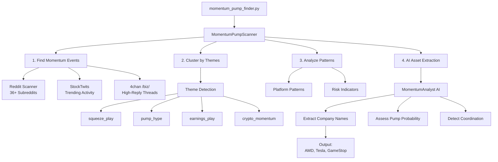

# The Intelligent LLM Investor 🤖💰

<div align="center">


**AI-Powered Pump & Dump Detection System**

*Detects cryptocurrency and stock pump & dump schemes by analyzing momentum patterns across social media*

</div>

---

## 🌟 Overview

The Intelligent LLM Investor uses advanced AI to detect pump & dump schemes by analyzing momentum patterns across social media platforms. Unlike traditional systems that monitor specific tickers, this system discovers pumps organically by detecting unusual activity patterns first, then identifying which assets are being manipulated.

### ✨ Key Features

- **🌊 Momentum-Based Detection**: Finds pumps by detecting activity surges, not by monitoring tickers
- **🔍 Asset Extraction**: AI automatically identifies company/crypto names from discussions  
- **📊 Multi-Platform Analysis**: Monitors Reddit (36+ subreddits), StockTwits, 4chan
- **🤖 AI-Powered Analysis**: Uses Claude 3.5 Sonnet for sophisticated pattern recognition
- **⚡ Real-Time Alerts**: Identifies high-risk patterns as they develop
- **📈 Risk Assessment**: Provides pump probability, coordination scores, and red flags

## 🚀 Quick Start

### Prerequisites

- Python 3.8+
- OpenRouter API key for Claude 3.5 Sonnet

### Installation

```bash
# Clone the repository
git clone https://github.com/yourusername/the-intelligent-llm-investor.git
cd the-intelligent-llm-investor

# Install dependencies
pip install -r requirements.txt

# Set your API key
export OPENROUTER_API_KEY="your-api-key-here"
```

### Basic Usage

```bash
# Run momentum-based pump detection
python momentum_pump_finder.py

# With custom parameters
python momentum_pump_finder.py --threshold 1.0 --hours 6 --analyze 3
```

### Parameters

- `--threshold`: Minimum momentum score (default: 2.0, lower = more sensitive)
- `--hours`: Time window to analyze (default: 6)
- `--analyze`: Number of top momentum clusters to analyze with AI (default: 5)

## 📊 How It Works

### 1. 🌊 Momentum Detection
The system scans for unusual activity patterns WITHOUT looking for specific tickers:
- **Reddit**: Analyzes engagement velocity across 36+ investing/crypto subreddits
- **StockTwits**: Detects activity bursts and trending discussions
- **4chan**: Monitors high-reply threads on /biz/

### 2. 🎯 Pattern Clustering
Momentum events are automatically grouped by themes:
```
squeeze_play     → Short squeeze discussions
pump_hype       → Explicit pump language
earnings_play   → Earnings-related momentum
crypto_momentum → Cryptocurrency pumps
sector_tech     → Technology sector activity
```

### 3. 🤖 AI Analysis
Claude 3.5 Sonnet analyzes top momentum clusters to:
- **Extract Asset Names**: Identifies companies/cryptos being discussed
- **Assess Pump Probability**: 0-100% likelihood of manipulation
- **Detect Coordination**: Cross-platform activity patterns
- **Identify Red Flags**: Urgency language, new accounts, unrealistic promises

### 4. ⚠️ Risk Assessment
```
LOW RISK     → Normal market discussion
MEDIUM RISK  → Elevated activity, monitor closely  
HIGH RISK    → Multiple pump indicators detected
```

## 📈 Example Output

```
🤖 AI ANALYSIS:
============================================================

📊 SECTOR TECH:
   Pump Probability: 75%
   Type: tech_penny_stock
   Coordination: 7/10
   Action: high_alert
   🎯 Assets Detected: AMD, OpenAI, Tesla
   📈 Top Mentions:
      • AMD: 15 mentions
      • Tesla: 8 mentions
      • OpenAI: 5 mentions
   ⚠️ Red Flags: coordinated surge, urgency language, new accounts

📊 SQUEEZE PLAY:
   Pump Probability: 82%
   Type: squeeze_play
   Coordination: 8/10
   Action: high_alert
   🎯 Assets Detected: GameStop, AMC Entertainment
   📈 Top Mentions:
      • GameStop: 23 mentions
      • AMC Entertainment: 18 mentions
   ⚠️ Red Flags: MOON language, short interest claims, coordinate timing

⚡ OVERALL RISK: HIGH
   Highest Pump Probability: 82%
```

## 🏗️ Architecture



## 📁 Project Structure

```
the-intelligent-llm-investor/
├── momentum_pump_finder.py      # Main entry point
├── config/
│   └── config.yaml             # Configuration settings
├── src/
│   ├── agents/
│   │   ├── momentum_analyst.py # AI momentum analysis
│   │   └── super_analyst.py    # Enhanced LLM analyzer
│   ├── scanners/
│   │   ├── momentum_pump_scanner.py # Core momentum engine
│   │   ├── social_pump_scanner.py   # Ticker-based scanner (legacy)
│   │   └── smart_pump_detector.py   # Pattern detection
│   ├── scrapers/
│   │   ├── yars_scraper.py     # Reddit (no API needed)
│   │   ├── stocktwits_scraper.py
│   │   ├── fourchan_biz_scraper.py
│   │   ├── investorshub_scraper.py
│   │   ├── bitcointalk_scraper.py
│   │   └── social_media_aggregator.py
│   └── utils/
│       ├── logger.py           # Logging utilities
│       ├── data_saver.py       # Data persistence
│       └── llm_formatter.py    # LLM optimization
```

## 🔧 Configuration

Edit `config/config.yaml` to customize:

### Subreddit Monitoring
```yaml
target_subreddits:
  high_risk:
    - pennystocks
    - CryptoMoonShots
    - Shortsqueeze
  medium_risk:
    - wallstreetbets
    - stocks
  crypto:
    - CryptoCurrency
    - SatoshiStreetBets
```

### Detection Settings
```yaml
pump_detection:
  smart_mode:
    enabled: true          # AI-based detection
    analyze_trending: true # Analyze patterns
  search_strategies:
    momentum_terms: ["squeeze", "moon", "rocket"]
    volume_terms: ["heavy buying", "accumulation"]
```

## 🛡️ Data Privacy

- All data is stored locally in `pump_data/`
- No data is sent to external services except OpenRouter for AI analysis
- Scraped content is preserved for transparency and verification

## ⚠️ Disclaimer

**IMPORTANT**: This tool is for educational and research purposes only. 

- Pump & dump schemes are illegal in most jurisdictions
- Never make investment decisions based solely on automated analysis
- Always conduct your own due diligence
- Past patterns don't guarantee future results

## 🤝 Contributing

Contributions are welcome! Please feel free to submit a Pull Request.

### Areas for Improvement
- Add more platform scrapers (Discord, Telegram)
- Implement real-time monitoring mode
- Add backtesting capabilities
- Improve ML-based pattern detection

## 📄 License

This project is licensed under the MIT License - see the LICENSE file for details.

## 🔗 Resources

- [OpenRouter API](https://openrouter.ai/) - LLM access
- [SEC Market Manipulation Guide](https://www.sec.gov/oiea/investor-alerts-bulletins/ia_pumpanddump.html)
- [Pump & Dump Detection Research](https://papers.ssrn.com/sol3/papers.cfm?abstract_id=3915196)

---

<div align="center">
Built with ❤️ for retail investor protection

**Stay informed. Stay safe. 🛡️**
</div>